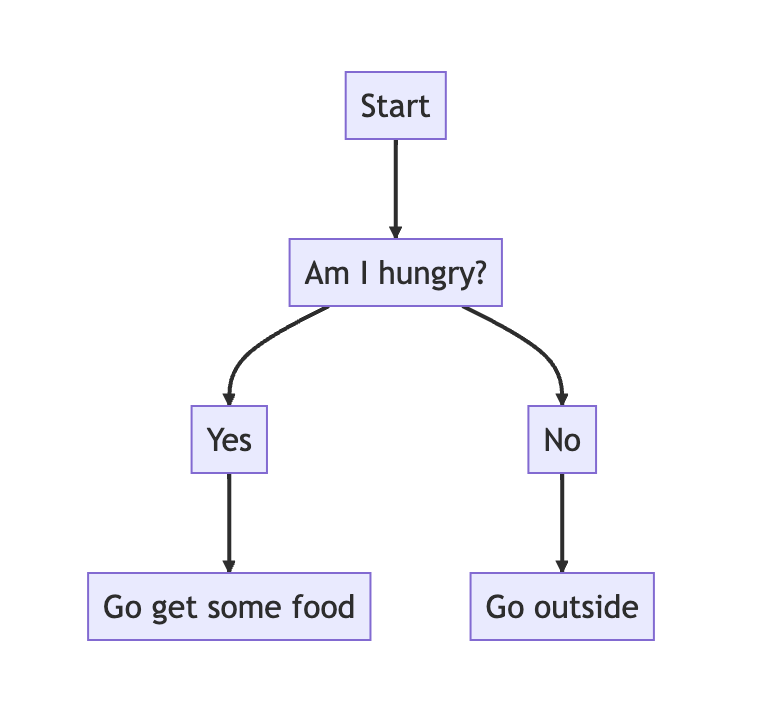

## Variables and Data Types
In Python, every value has an associated type with it. For instance:

```python
a_string = "hello" # the value is a string (or str)
an_integer = 5 # the value is an integer (or int)
a_float = 1.7 # the value is a float
a_boolean = True # the value is a bool, meaning True or False
```

These values can be stored in what's called a `variable`. In the example above these are `a_string`, `an_integer`, `a_float`, and `a_boolean`. When you reference these words, that you get to name, the Python interpreter will give you back its' value.

```shell
>>> hello = 40
>>> hello
40
```

When I reference the variable `hello`, it will always return to me the value I assigned to it `40`.

## Naming Variables
In Python, there are certain rules and styles you should adhere to for naming your variable. In general we use what is called "snake case" which is just an underscore character between the words.

```python
sample_variable = 10
another_longer_variable = "foo"
```

In addition to this, there are *invalid* variable names as well: 

```python
sample-variable = 10
sample variable = 10
1sample_variable = 10
''sample_variable = 10 
sample_&variable = 10
1234 = 10
```

hyphens, spaces, starting with a number, being a number, special characters are not allowed so keep that in mind when coming up with variable names

## Comments
These will come in handy when you step away from your code from a while and come back to it wondering "what was I trying to do here"

```python
# a note to future self
foo = 10
bar = 10.5
```

A comment needs to start with the `#` character on each line you want the comment. You can use comments to temporarily "delete" lines too that you may want to bring back at some later point but don't want to deal with the hassle of copy/pasting it to another document and then bringing it back

## Flow Control
The concept of flow control is what makes programming so powerful. Yes we could try to code things in one big series of instructions but that will get unwieldy quickly. With flow control we can do actions based on conditions, think of a flow chart:



The condition here would be the question `Am I hungry?`. We can represent the above chart in Python code as well:

```Python
if am_i_hungry:
    eat()
else:
    go_outside()
```

The first line checks a variable called `am_i_hungry`, which can evaluate to `True` or `False`. If the value is `True` it goes inside the `if` and calls the function `eat()`. If the `am_i_hungry` variable is `False`, however, the control flow falls to the `else` and drops into it, resulting in the `go_outside()` function to be called instead

### Comparison Operators
In order to make this `if/else` structure even more powerful, we have things called comparison operators:

- `==`, or "equal to"
- `!=`, or "not equal to"
- `<`, or "less than"
- `>`, or "greater than"
- `<=`, or "less than or equal to"
- `>=`, or "greater than or equal to"

You can now use these to compare two different variables. For instance:

```Python
number_of_potatoes = 5

if number_of_potatoes == 5:
    print("Number of potatoes is equal to 5!")
else:
    print("Number of potatoes is NOT equal to 5!")
```

which results in

```
Number of potatoes is equal to 5!
```

Additionally, we can do a if/else with more than two condition checks, this is called `if, elif, else` ()

```Python
number_of_potatoes = 5

if number_of_potatoes == 0:
    print("We have no potatoes")
elif number of potatoes < 5:
    print("We have less than 5 potatoes")
else:
    print("We have 5 or more potatoes)
```

Basically the flow of this is that Python checks the first condition, if it's not satisfied, it will move to the next one and continue in that fashion until it reaches a condition that is satisfied. The `else` is also optional; you can leave it off if you dont want a catch-all condition

> **_NOTE:_**  `elif` can be thought of as a combination/shorthand "else-if" and be written out like:
> ```Python
> number_of_potatoes = 5
> if number_of_potatoes == 0:
>     print("We have no potatoes")
> else:
>     if number_of_potatoes < 5:
>         print("We have 5 or more potatoes!")
> ```
> This looks way more complicated though so using `elif` is the way to go

## Functions
Functions are a concept that are most used as a way to package up a series of steps that you want to be easily used anywhere.

As an example, let's say you want to add two numbers

```Python 
first_number = 5
second_number = 10

sum_of_two_numbers = first_number + second_number
```

That's cool, but what if you want to add _any_ two numbers together? You would have to copy and paste every time you wanted to do that and your code would look immensely messy. Functions are here to save the day:

```Python
def add_two_numbers(first_number, second_number):
    sum_of_two_numbers = first_number + second_number
    return sum_of_two_numbers

# now we can call our function with anything!
variable_to_hold_sum = add_two_numbers(5, 10)
another_variable_to_hold_sum = add_two_numbers(1, 2)
yet_another_variable_to_hold_sum = add_two_numbers(100, 500)
```

Lets break down the above snippet into parts. First is the keyword `def`. Using this tells Python that we're going to create a function and name it the following name: `add_two_numbers`. In the parenthesis, we can list our `parameters` which can be thought of as inputs into the function. In the body of the fuction we have our summation line and then we have another keyword `return`. This keyword tells Python that this function will return some value that can be assigned.

You can see on the lines following the function we call the function 3 times, giving different parameters each time and assigning the values of those calls to the variables `variable_to_hold_sum`, `another_variable_to_hold_sum`, and `yet_another_variable_to_hold_sum`