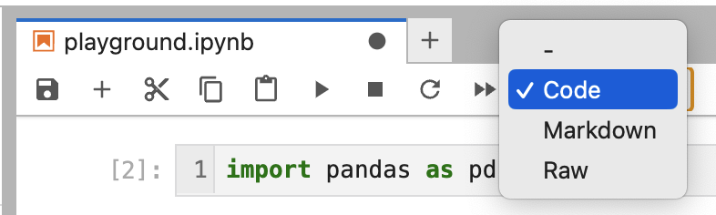
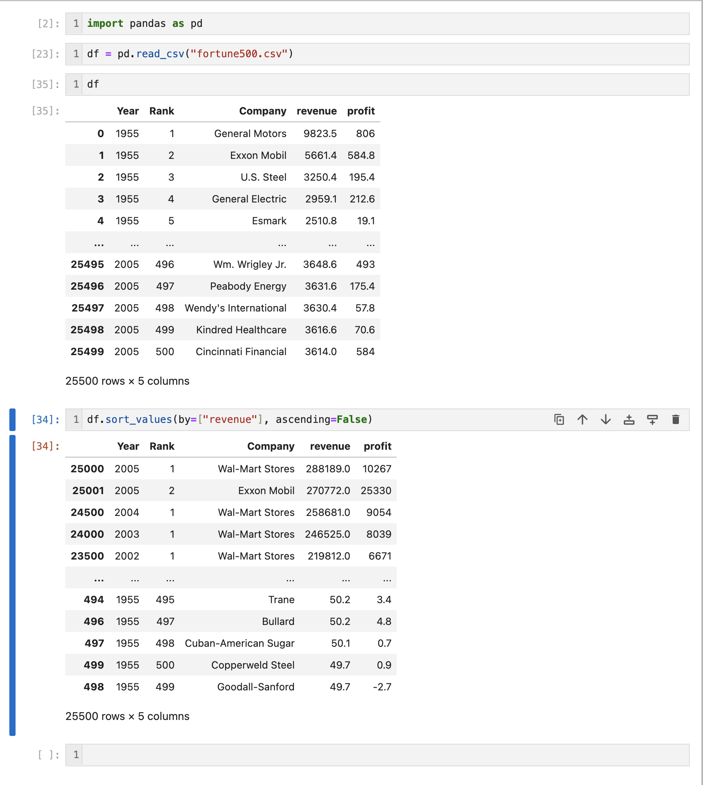

# Jupyter notebook
## What is it?
A Jupyter notebook is an all-in-one document that lets you write code for data analysis and view the results in a nice human-readable way with figures, links, etc

## How do I install it on my computer?
Navigate to the relases on their [Github Page](https://github.com/jupyterlab/jupyterlab-desktop/releases) and search for the platform you use. If you're using an Intel mac then click on the one that says `x64` if you use the newer mac then click one the one that says `arm`. Remember to click on the `.dmg` file, not the `.zip`

## Using a Jupyter notebook to import data
There are several ways to import data into a notebook. The first thing you'll want to do is figure out what sort of format your data is in. 

## How does a Jupyter notebook work?
A notebook is made up of cells which run code that you write. Additionally, you can also write markdown in this cells to explain or document what you're doing

When writing some code to extract data you want from your data set, you can either use multiple cells, or do it all in one cell. Generally speaking, it's a good idea to separate "concepts" in different cells rather than trying to do everything in one. Below is an example of what a notebook might look like

In the first cell, we want to import our pandas library so we can do some data analysis. On the second line, we read in our data from a CSV (comma separated value) file into a data frame I've named `df`. Then I just called the data frame by writings its' name and it outputs what it looks like. In the final cell, I call a function called `sort_values` that will sort each row in our data frame by a column (or columns!) we specify in the parameters. I've chosen to sort bye the `revenue` column, and in ascending order. 

> **_NOTE:_**  I did use multiple cells, but you can also use 1 cell to achieve the exact same thing, just remember that every cell has its own output so if you want to output multiple things you'll either have to code it that way, or just use different cells
